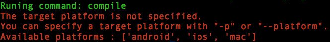

# cocos compile

## Overview
Build an existed project.

## Usage

```
usage: cocos compile [-h] [-s SRC_DIR] [-q] [-p PLATFORM] [-m MODE] [-j JOBS]
                     [--ap ANDROID_PLATFORM] [--ndk-mode NDK_MODE]
                     [--source-map] [--sign-identity SIGN_ID] [--no-res]
                     [--compile-script {0,1}] [--lua-encrypt]
                     [--lua-encrypt-key LUA_ENCRYPT_KEY]
                     [--lua-encrypt-sign LUA_ENCRYPT_SIGN]
```

## Available Arguments

* **Common Arguments:**

	arg | available value | sample | description | necessary
	:------------: | :-------------: | :------------: | :------------: | :------------:
	-h, --help | - | - | Show the help message and exit  | no
	-s, --src | project path | 	`./projects/MyLuaGame` | Specify the project path. Default value is current directory. | no
	-p, --platform | the target platform | `android` | Specify the target platform. | yes
	-m, --mode | the compiling mode | `release` | Set the compile mode, should be `debug` or `release`. Default is debug. | no
	-j, --jobs | number of jobs at once | `4` | Use N jobs at once. It's only take effect with target `android` & `linux`.  | no

* **Android Arguments:**

	arg | available value | sample | description | necessary
	:------------: | :-------------: | :------------: | :------------: | :------------:
	--ap | int value (must >= 10) | `16` | Specify the API-Level of android sdk. Console will auto select it if not specified. | no
	--ndk-mode | the compiling mode of ndk-build | `release` | Set the compile mode of ndk-build, should be one of {debug, release, none}, native code will not be compiled when the value is none. Default is same value with `-m` | no
	
* **Web Arguments:**

	arg | available value | sample | description | necessary
	:------------: | :-------------: | :------------: | :------------: | :------------:
	--source-map | - | - | Enable source-map | no

* **iOS Arguments:**

	arg | available value | sample | description | necessary
	:------------: | :-------------: | :------------: | :------------: | :------------:
	--sign-identity | the code sign identity | `"iPhone Distribution:xxxxxxxx"` | The code sign identity for iOS. | It's required when the value of "-m, -mode" is release.

* **lua/js project Arguments:**

	arg | available value | sample | description | necessary
	:------------: | :-------------: | :------------: | :------------: | :------------:
	--compile-script | {0,1} | `1` | Disable/Enable the compiling of lua/js script files. If not specified, the value is `1` when `-m, --mode` is `release`. Otherwise, the value is `0` | no

* **lua project Arguments:**

	arg | available value | sample | description | necessary
	:------------: | :-------------: | :------------: | :------------: | :------------:
	--lua-encrypt | - | - | Enable the encrypting of lua scripts. It's only take effect when `--compile-script` value is `1` | no
	--lua-encrypt-key | any string | `MyLuaKey` | Specify the encrypt key for the encrypting of lua scripts. It's only take effect when `--lua-encrypt` is enabled. Default value is `2dxLua`. | no
	--lua-encrypt-sign | any string | `MyLuaSign` | Specify the encrypt sign for the encrypting of lua scripts. It's only take effect when `--lua-encrypt` is enabled. Default value is `XXTEA`. | no

## Attentions
* You can see the valid target platforms without specify `-p, --platform` first. The available platforms will be shown like this:
	
* `--compile-script` will not take effect when target is `linux` or `web`
* If `--lua-encrypt` is enabled, you should modify the C++ code `frameworks/runtime-src/Classes/AppDelegate.cpp` like this:  

	```
	bool AppDelegate::applicationDidFinishLaunching()
	{
		...
		
		auto engine = LuaEngine::getInstance();
    	ScriptEngineManager::getInstance()->setScriptEngine(engine);
    	
    	// add these two lines 
    	// "MyLuaKey" is the string specified by "--lua-encrypt-key"
    	// "MyLuaSign" is the string specified by "--lua-encrypt-sign"
    	LuaStack* stack = engine->getLuaStack();
    	stack->setXXTEAKeyAndSign("MyLuaKey", strlen("MyLuaKey"), "MyLuaSign", strlen("MyLuaSign"));
    	
		...
	}
	```

## Samples

* `cocos compile -h`. Show the help message.
* `cocos compile -s ./projects/MyLuaGame -p android --ndk-mode release --compile-script 1 --lua-encrypt`  
	Build `MyLuaGame` for android with ndk-build is release. And compile lua script files with encrypting.
* `cocos compile -s ./projects/MyLuaGame -p ios -m release --sign-identity "iPhone Distribution:xxxxxxxx"`  
 	Build `MyLuaGame` for ios with release mode. Use the code sign identity `"iPhone Distribution:xxxxxxxx"`. 