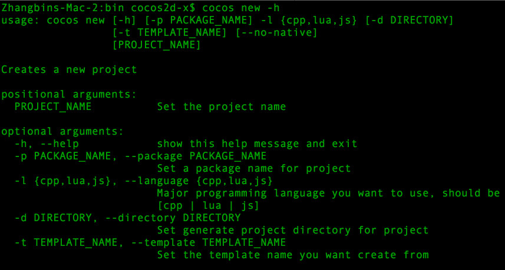

# cocos new

## Overview

Create a new `-x` or `-js` project.

## Usage

`cocos new -l {cpp,lua,js} [arguments] [PROJECT_NAME]`

## Available Arguments

arg | available value | sample | description | necessary
:------------: | :-------------: | :------------: | :------------: | :------------:
-h, --help | - | - | Show the help message and exit  | no
-p, --package | string match `*.*.*` | `com.company.pkgname` | Set a package name for project. Default is same with template  | no
-l, --language | {cpp, lua, js} | lua | Major programming language you want to use. | yes
-d, --directory | a absolute(relative) path | `./projects/` | Set generate project directory for project. Default is current directory | no
-t, --template | a string of template name | `runtime` | Set the template name you want create from. Default value is `default` | no
--ios-bundleid | string match `*.*.*` | `com.company.pkgname` | Set the bundle ID of iOS. | no
--mac-bundleid | string match `*.*.*` | `com.company.pkgname` | Set the bundle ID of Mac. | no
--portrait | - | - | Set the project be portrait. | no

## Attentions

The logic of looking for template is:

1. Generate the template folder name with `[language]-template-[template name]`.  
	For example: The template folder name of `cocos new -l lua -t runtime` is `lua-template-runtime`
2. Find the template folder in the `templates` directory of engine.

## Samples

* `cocos new -h`. Show the help message like this:
	
* `cocos new -l lua -p org.cocos2dx.mygame -d ./projects -t runtime MyLuaGame`  
The properties of the created project is:  
	* language is `lua`
	* package name is `org.cocos2dx.mygame`
	* target directory is `./projects`
	* project name is `MyLuaGame`
	* template name is `runtime`
