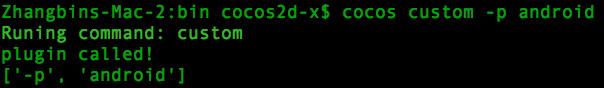

# cocos2d-console

## Overview
cocos2d-console is a command line tool for cocos2d-x & cocos2d-js. It contains several commands for developers to `create, compile, run` the `-x` or `-js` projects.

The cocos2d-console is implemented by `Python`. You can use it in `Windows, Mac or Linux`.

## Requirement

* Python 2.7 is required *(Now only support version 2.7)*.
* Required by iOS & Mac:
	* XCode
* Required by android:
	* [Android NDK](https://developer.android.com/tools/sdk/ndk/)
	* [Android SDK](https://developer.android.com/tools/sdk/)
	* [Apache Ant](http://ant.apache.org/)
* Required by win32:
	* Visual Studio
* Required by linux:
	* Please run the `build/install-deps-linux.sh` in `cocos2d-x` or `cocos2d-js` to install the dependencies.
	
## Setup Environment
Run the `setup.py` in the root directory of `cocos2d-x` or `cocos2d-js`.  
If you are developing games for android, you should input the `Android SDK`, `Android NDK` & `Apache Ant` path when the setup is running.

## Usage
Use the command line like this:`cocos [command] [arguments]`

Available commands:

* [new](cocos-new.md)
* [compile](cocos-compile.md)
* [deploy](cocos-deploy.md)
* [run](cocos-run.md)
* [jscompile](cocos-jscompile.md)
* [luacompile](cocos-luacompile.md)

## Attentions  
There are depend relationship between commands. Two rules about dependencies:  

* The dependent commands will be invoked first.
* If command A depend on command B. When you are using command A, the arguments you used will be passed to command B.

For example: Command `run` depends on command `deploy`, and `deploy` depends on `compile`.  

* The command order is `compile->deploy->run`.
* You can use command `run` like this: `cocos run -p android --ndk-mode release`  
(`-p` is available argument of `run`, `--ndk-mode` is available argument of `compile`)

## How to add command

1. Edit `bin/cocos2d.ini`, and add the class name of your new plugin there. For example:  

	```
	plugin_custom.CCPluginCustom
	``` 

2. Create a file called `plugin_custom.py` in the `plugins` folder.
	A new, empty plugin, would look like the code shown below:

	```
	import cocos

    # Plugins should be a subclass of CCPlugin
    class CCPluginCustom(cocos.CCPlugin):   
        # in default category
        @staticmethod
        def plugin_category():
            return ""

        @staticmethod
        def plugin_name():
            return "custom"

        @staticmethod
        def brief_description():
            return "A custom plugin"                

        def run(self, argv, dependencies):
            print "plugin called!"
            print argv
	```
3. Check the added command. The output of `cocos -h` will show the available commands:  
	
	
	The result of run the command `cocos custom -p android` will look like this:  
	

## Contributing

The code repository of `cocos2d-console` is on github: [console repository](https://github.com/cocos2d/cocos2d-console)  
You can fork this github repository, add your contribution, then send a pull request to us.
