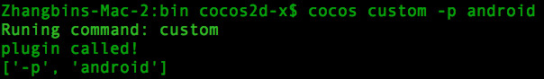

# 一. Cocos Console 简介

## 简介

Cocos Console 是一个命令行工具集。可以用于创建，编译，运行 cocos 工程。

此工具使用 Python 语言开发，适用于 Windows，Mac 和 Linux 系统。

## 环境要求

* Python 2.7 *(目前只支持 2.7 版本，不支持 3.x)*.
* 开发 iOS & Mac 程序需要:
	* XCode
* 开发 Android 程序需要:
	* [Android NDK](https://developer.android.com/tools/sdk/ndk/)
	* [Android SDK](https://developer.android.com/tools/sdk/)
	* [Apache Ant](http://ant.apache.org/)
* 开发 windows 程序需要:
	* Visual Studio
* 开发 linux 程序需要:
	* 运行 `cocos2d-x` 或者 `cocos2d-js` 中的 `build/install-deps-linux.sh` 脚本来安装依赖的环境。
	
## 设置环境变量

运行 `cocos2d-x` 或者 `cocos2d-js` 根目录下的 `setup.py`。  
如果需要开发 Android 程序，`setup.py` 执行过程中需要输入 `Android SDK`, `Android NDK` & `Apache Ant` 三个路径。

## 用法

命令行的用法：`cocos [command] [arguments]`

可用的命令:

* [new](#new)
* [compile](#compile)
* [deploy](#deploy)
* [run](#run)
* [jscompile](#jscompile)
* [luacompile](#luacompile)
* [gen-libs](#gen-libs)
* [gen-simulator](#gen-simulator)
* [gen-templates](#gen-templates)

## 注意事项

各个命令直接有依赖关系。依赖关系的规则如下：

* 一个命令所依赖的命令会先被执行。
* 如果命令 A 依赖命令 B。那么在执行 A 命令时，所有参数都会传递给 B 命令。

示例： `run` 依赖 `deploy`，并且 `deploy` 依赖 `compile`。

* 命令的执行顺序 `compile->deploy->run`。
* 执行 `cocos run -p android --ndk-mode release` 这个命令时，(`-p` 是 `run` 命令的参数，而 `--ndk-mode` 是用于 `compile` 命令的参数。)

## 如何增加一个新的命令

1. 编辑 `bin/cocos2d.ini`，添加新增命令的类名，示例:  

	```
	plugin_custom.CCPluginCustom
	``` 

2. 在 `plugins` 目录添加一个文件 `plugin_custom.py`。文件内容如下：

	```
	import cocos

    # 这个类需要为 cocos.CCPlugin 的子类
    class CCPluginCustom(cocos.CCPlugin):   
        @staticmethod
        def plugin_category():
            return ""

        @staticmethod
        def plugin_name():
            return "custom"

        @staticmethod
        def brief_description():
            return "A custom plugin"                

        def run(self, argv, dependencies):
            print "plugin called!"
            print argv
	```

3. 执行 `cocos -h` 查看新增的命令：
	
	
	执行 `cocos custom -p android` 的输出如下图：  
	

# [二. cocos new](id:new)

## 简介

创建一个新的 cocos 工程。

## 用法

`cocos new -l {cpp,lua,js} [arguments] [PROJECT_NAME]`

## 参数说明

参数 | 可用值 | 示例 | 描述 | 是否必需
:------------: | :-------------: | :------------: | :------------: | :------------:
-h, --help | - | - | 显示帮助信息 | 否
-p, --package | `*.*.*` 格式的字符串 | `com.company.pkgname` | 设置工程的包名 | 否
-l, --language | {cpp, lua, js} | lua | 指定工程的编程语言。 | 是
-d, --directory | 绝对路径或者相对路径 | `./projects/` | 指定工程的存放路径，默认为当前路径。 | 否
-t, --template | 模板名称 | `runtime` | 指定使用的模板名称，默认值为 `default` | 否
--ios-bundleid | `*.*.*` 格式的字符串 | `com.company.pkgname` | 设置 iOS 的 bundle ID。 | 否
--mac-bundleid | `*.*.*` 格式的字符串 | `com.company.pkgname` | 设置 Mac 的 bundle ID。 | 否
--portrait | - | - | 设置工程为竖屏。 | 否

## 注意事项

查找模板的逻辑：

1. 生成模板文件夹字符串，规则：`[语言]-template-[模板名称]`。  
示例：命令 `cocos new -l lua -t runtime` 所要查找的模板文件夹为 `lua-template-runtime`
2. 在引擎的 `templates` 目录查找模板文件夹。

## 示例

* `cocos new -h`。显示帮助信息。
	
* `cocos new -l lua -p org.cocos2dx.mygame -d ./projects -t runtime MyLuaGame`  
创建的工程属性： 
	* 语言：`lua`
	* 包名：`org.cocos2dx.mygame`
	* 存放路径：`./projects`
	* 工程名称：`MyLuaGame`
	* 模板名称：`runtime`

# [三. cocos compile](id:compile)

## 简介

编译并打包 cocos 工程。

## 用法

```
usage: cocos compile [-h] [-s SRC_DIR] [-q] [-p PLATFORM]
                     [--proj-dir PROJ_DIR] [-m MODE] [-j JOBS] [-o OUTPUT_DIR]
                     [--ap ANDROID_PLATFORM] [--ndk-mode NDK_MODE]
                     [--app-abi APP_ABI] [--ndk-toolchain TOOLCHAIN]
                     [--ndk-cppflags CPPFLAGS] [--android-studio]
                     [--vs VS_VERSION] [--source-map] [--advanced]
                     [-t TARGET_NAME] [--sign-identity SIGN_ID] [--no-res]
                     [--compile-script {0,1}] [--lua-encrypt]
                     [--lua-encrypt-key LUA_ENCRYPT_KEY]
                     [--lua-encrypt-sign LUA_ENCRYPT_SIGN]
```

## 参数说明

* **通用参数：**

	参数 | 可用值 | 示例 | 描述 | 是否必需
	:------------: | :-------------: | :------------: | :------------: | :------------:
	-h, --help | - | - | 显示帮助信息。 | 否
	-s, --src | 工程路径 | `./projects/MyLuaGame` | 指定工程路径，默认值为当前路径。 | 否
	-p, --platform | 编译的平台 | `android` | 指定要编译的平台。 | 是
	-m, --mode | 编译模式 | `release` | 指定编译模式，`debug` 或者 `release`。默认值为`debug` | 否
	-j, --jobs | 使用 cpu 的数量 | `4` | 指定编译过程使用几个 cpu。只有在编译 `android` 和 `linux`平台时起效。 | 否
	-o, --output-dir | 输出路径 | `./output` | 指定输出文件路径。 | 否

* **Android 平台参数：**

	参数 | 可用值 | 示例 | 描述 | 是否必需
	:------------: | :-------------: | :------------: | :------------: | :------------:
	--ap | 整数 (必须 >= 10) | `16` | 指定要使用的 Android API-Level。如果未指定，则从 SDK 中自动选择。 | 否
	--ndk-mode | 调用 ndk-build 的模式 | `release` | 设置 ndk-build 的模式。可选值： {debug, release, none}。如果指定为 none，则跳过 ndk-build 步骤。默认值与 `-m` 参数值一致。 | 否
	--android-studio | - | - | 指定编译 Android Studio 工程。 | 否

* **Windows 平台参数：**

	参数 | 可用值 | 示例 | 描述 | 是否必需
	:------------: | :-------------: | :------------: | :------------: | :------------:
	--vs | 整数 | `2013` | 指定编译所使用的 Visual Studio 版本。如：2013。默认自动查找可用版本。 | 否

* **Web 平台参数：**

	参数 | 可用值 | 示例 | 描述 | 是否必需
	:------------: | :-------------: | :------------: | :------------: | :------------:
	--source-map | - | - | 启用 source-map | 否
	--advanced | - | - | 使用 closure 编译器的高级模式编译 js 文件，会获得更高的压缩率，但是有出现 bug 的风险。 | 否

* **iOS/Mac 平台参数：**

	参数 | 可用值 | 示例 | 描述 | 是否必需
	:------------: | :-------------: | :------------: | :------------: | :------------:
	-t, --target | target 名称 | `MyLuaGame iOS` | 指定需要编译的 xcode 工程中的 target。 | 否 

* **iOS 平台参数：**

	参数 | 可用值 | 示例 | 描述 | 是否必需
	:------------: | :-------------: | :------------: | :------------: | :------------:
	--sign-identity | 代码签名 ID | `"iPhone Distribution:xxxxxxxx"` | 编译 iOS device 版本时使用的代码签名 ID | 否

* **lua/js 工程参数：**

	参数 | 可用值 | 示例 | 描述 | 是否必需
	:------------: | :-------------: | :------------: | :------------: | :------------:
	--compile-script | {0,1} | `1` | 开启/关闭将 lua/js 脚本编译为字节码的功能。如果此参数未指定，那么当 `-m` 参数为 `release` 时，此参数值为 `1`；否则此参数值为 `0` | 否

* **lua 工程参数：**

	参数 | 可用值 | 示例 | 描述 | 是否必需
	:------------: | :-------------: | :------------: | :------------: | :------------:
	--lua-encrypt | - | - | 启用 lua 脚本的 XXTea 加密功能。 | 否
	--lua-encrypt-key | 任意字符串 | `MyLuaKey` | 指定 XXTea 加密算法的 key。只有使用了 `--lua-encrypt` 参数时起效。默认值为 `2dxLua`。 | 否
	--lua-encrypt-sign | 任意字符串 | `MyLuaSign` | 指定 XXTea 加密算法的 sign。只有使用了 `--lua-encrypt` 参数时起效。默认值为 `XXTEA`。 | 否

## 注意事项

* 执行命令时，如果不指定 `-p, --platform` 参数，会输出可用的平台，如下图：
	
* 在编译 `linux` 和 `web` 两个平台时，不支持 `--compile-script` 参数。
* 如果启用了 `--lua-encrypt` 参数，需要修改 C++ 代码文件 `frameworks/runtime-src/Classes/AppDelegate.cpp`：

	```
	bool AppDelegate::applicationDidFinishLaunching()
	{
		...
		
		auto engine = LuaEngine::getInstance();
    	ScriptEngineManager::getInstance()->setScriptEngine(engine);
    	
    	// add these two lines 
    	// "MyLuaKey" is the string specified by "--lua-encrypt-key"
    	// "MyLuaSign" is the string specified by "--lua-encrypt-sign"
    	LuaStack* stack = engine->getLuaStack();
    	stack->setXXTEAKeyAndSign("MyLuaKey", strlen("MyLuaKey"), "MyLuaSign", strlen("MyLuaSign"));
    	
		...
	}
	```

## 示例

* `cocos compile -h` 显示帮助信息。
* `cocos compile -s ./projects/MyLuaGame -p android --ndk-mode release --compile-script 1 --lua-encrypt`  
	编译 `MyLuaGame` 工程的 Android 平台。ndk-build 模式为 release。并且编译 & 加密 lua 脚本。
* `cocos compile -s ./projects/MyLuaGame -p ios -m release --sign-identity "iPhone Distribution:xxxxxxxx"`  
 	编译 `MyLuaGame` 工程的 iOS 平台，使用 release 模式，并且使用代码签名 ID：`"iPhone Distribution:xxxxxxxx"`. 

# [四. cocos deploy](id:deploy)

## 简介

编译并在设备或模拟器上部署工程。

## 用法

`cocos deploy [-h] [-s SRC_DIR] [-q] [-p PLATFORM] [-m MODE]`

## 依赖的命令

* [compile](cocos-compile.md)

## 参数说明

参数 | 可用值 | 示例 | 描述 | 是否必需
:------------: | :-------------: | :------------: | :------------: | :------------:
-h, --help | - | - | 显示帮助信息。 | 否
-s, --src | 工程路径。 | `./projects/MyLuaGame` | 指定工程路径，默认值为当前路径。 | 否
-p, --platform | 编译的平台 | `android` | 指定要编译的平台。 | 是
-m, --mode | 编译模式 | `release` | 指定编译模式，`debug` 或者 `release`。默认值为`debug` | 否

## 注意事项

* 目前此命令只有在 `-p` 参数为 `android` 时有效果。会在模拟器或者设备上重新安装 apk。

## 示例

* `cocos deploy -h` 显示帮助信息。
* `cocos deploy -s ./projects/MyLuaGame -p andoird -m release`  
	编译 `MyLuaGame` 工程并，将 apk 安装到设备或者模拟器上。
	
# [五. cocos run](id:run)

## 简介

编译工程，并在设备或者模拟器上部署和运行工程。

## 用法

```
cocos run [-h] [-s SRC_DIR] [-q] [-p PLATFORM] [-m MODE] [-b BROWSER]
          [--host [SERVER_HOST]] [--port [SERVER_PORT]]
```

## 依赖的命令

* [deploy](cocos-deploy.md)

## 参数说明

* **通用参数：**  

	参数 | 可用值 | 示例 | 描述 | 是否必需
	:------------: | :-------------: | :------------: | :------------: | :------------:
	-h, --help | - | - | 显示帮助信息。 | 否
	-s, --src | 工程路径 | `./projects/MyLuaGame` | 指定工程路径，默认值为当前路径。 | 否
	-p, --platform | 运行的平台 | `android` | 指定要运行的平台。 | 是
	-m, --mode | 编译模式 | `release` | 指定编译模式，`debug` 或者 `release`。默认值为`debug` | 否

* **Web 平台参数：**

	参数 | 可用值 | 示例 | 描述 | 是否必需
	:------------: | :-------------: | :------------: | :------------: | :------------:
	--host | 服务器的 ip 地址 | `127.0.0.1` | 设置本地服务器的主机地址，默认值为 127.0.0.1 | 否
	--port | 服务器端口号 | `8000` | 设置本地服务器的端口，默认值为 8000 | 否
	-b, --browser | 浏览器程序路径 | `/Applications/Chrome.app` | 设置指定浏览器打开 url。如果未指定使用系统默认浏览器。 | 否
	--param | 指定启动浏览器的附加参数。 | - | 用于 web simulator 的参数。 | 否


## 注意事项

* 目前不支持在 iOS 设备上运行工程。

## 示例

* `cocos run -h` 显示帮助信息。
* `cocos run -s ./projects/MyLuaGame -p android -m release`  
	使用 release 模式编译 `MyLuaGame` 工程，并在 Android 设备或者模拟器上运行工程。

# [六. cocos jscompile](id:jscompile)

## 简介

对 js 文件进行加密和压缩处理。

## 用法

```
cocos jscompile [-h] [-v] [-s SRC_DIR_ARR] [-d DST_DIR] [-c]
				[-o COMPRESSED_FILENAME] [-j COMPILER_CONFIG]
				[-m CLOSURE_PARAMS]
```

## 参数说明

参数 | 可用值 | 示例 | 描述 | 是否必需
:------------: | :-------------: | :------------: | :------------: | :------------:
-h, --help | - | - | 显示帮助信息。 | 否
-s, --src | js 文件路径。 | 	`./projects/MyJSGame/src` | 指定需要编译的 js 文件路径，支持指定多个路径。 | 是
-d, --dst | 输出文件路径。 | `./projects/MyJSGame/src` | 指定输出文件的路径。 | 是
-c, --use_closure_compiler | - | - | 使用 closure 编译器将所有 js 文件压缩为一个大的文件。 | 否
-o, --output_compressed_filename | 文件名 | `MyJS.js` |  指定压缩为一个大的 js 文件名称。只有当使用了 '-c' 参数时起效。 | 否
-j, --compiler_config | - | - | 指定 json 格式的 closure 编译器配置，请参考compiler_config_sample.json。 | 否
-m, --closure_params | - | - | 传给 closure 编译器的扩展参数。会覆盖 closure 编译器的已有配置。 | 否

## 示例

* `cocos jscompile -h` 显示帮助信息。
* `cocos jscompile -s ./projects/MyJSGame/src -d ./projects/MyJSGame/src`  
	将 `./projects/MyJSGame/src` 文件夹下的 js 文件编译为 jsc 文件。

# [七. cocos luacompile](id:luacompile)

## 简介

Compile the `.lua` files to `.luac`.

## 用法

```
cocos luacompile [-h] [-v] [-s SRC_DIR_ARR] [-d DST_DIR] [-e]
				[-k ENCRYPTKEY] [-b ENCRYPTSIGN] [--disable-compile]
```

## 参数说明

参数 | 可用值 | 示例 | 描述 | 是否必需
:------------: | :-------------: | :------------: | :------------: | :------------:
-h, --help | - | - | 显示帮助信息 | 否
-s, --src | lua 文件路径 | 	`./projects/MyLuaGame/src` | 指定需要编译的 lua 文件路径，支持指定多个路径。 | 是
-d, --dst | 输出文件路径。 | `./projects/MyLuaGame/src` | 指定输出文件的路径。 | 是
-e, --encrypt | - | - | 开启 XXTEA 加密功能。 | 否
-k, --encryptkey | 字符串 | `MyLuaKey` | 指定 XXTea 加密算法的 key。只有使用了 `-e` 参数时起效。默认值为 `2dxLua`。 | 否
-b, --encryptsign | 字符串 | `MyLuaSign` | 指定 XXTea 加密算法的 sign。只有使用了 `-e` 参数时起效。默认值为 `XXTEA`。 | 否

## 示例

* `cocos luacompile -h` 显示帮助信息。
* `cocos luacompile -s ./projects/MyLuaGame/src -d ./projects/MyLuaGame/src -e -k MyLuaKey -b MyLuaSign`  
	将 `./projects/MyLuaGame/src` 文件夹下的 lua 文件编译为 luac 文件，并使用 XXTea 算法进行加密。加密的 key 为 `MyLuaKey`，加密的 sign 为：`MyLuaSign`。
	
# [八. cocos gen-libs](id:gen-libs)

## 简介

生成引擎的预编译库。生成的库文件会保存在引擎根目录的 'prebuilt' 文件夹。

## 用法

```
usage: cocos gen-libs [-h] [-c] [-e ENGINE_PATH] [-p {ios,mac,android,win32}]
                      [-m {debug,release}] [--dis-strip] [--vs VS_VERSION]
                      [--app-abi APP_ABI]
```

## 参数说明

* **通用参数：**

	参数 | 可用值 | 示例 | 描述 | 是否必需
	:------------: | :-------------: | :------------: | :------------: | :------------:
	-h, --help | - | - | 显示帮助信息。 | 否
	-c | - | - | 生成预编译库之前先删除 'prebuilt' 文件夹。 | 否
	-e | 引擎路径 | `~/Work/cocos2d-x` | 指定引擎文件夹。默认值为当前工具所在的引擎根目录。 | 否
	-p | ios, mac, android, win32 | `mac` | 指定需要编译的目标平台。可以通过多个'-p' 参数指定编译多个目标平台。默认编译所有可用的目标平台。 | 否
	-m | debug, release | `debug` | 指定使用 debug 或者 release 模式来生成预编译库。默认值为 release。 | 否
	--dis-strip | - | - | 关闭生成预编译库的 strip 功能。 | 否

* **Android 平台参数：**

	参数 | 可用值 | 示例 | 描述 | 是否必需
	:------------: | :-------------: | :------------: | :------------: | :------------:
	--app-abi | x86, armeabi, armeabi-v7a | `armeabi:x86` | 设置 ndk-build 的 APP_ABI 属性。可以使用 ':' 分隔多个值。示例：`--app-aib armeabi:x86:mips`。默认值为 'armeabi'。 | 否	
* **Windows 平台参数：**

	参数 | 可用值 | 示例 | 描述 | 是否必需
	:------------: | :-------------: | :------------: | :------------: | :------------:
	--vs | 整数 | `2013` | 指定使用的 Visual Studio 版本，例如 2013。默认自动查找可用的版本。 | 否

## 注意事项

* 不同的操作系统中可用的目标平台是不一样的：
	
	* Mac : ios, mac, android  
	* Windows : android, win32  
	* Linux : android

* 如果需要一次生成多个目标平台的预编译库，可以通过多次使用 `-p` 参数来实现。例如： `-p ios -p mac` 会同时生成 iOS 和 Mac 两个目标平台的预编译库。

## 示例

* `cocos gen-libs -h`。显示帮助信息
* `cocos gen-libs -c`  
删除 `prebuilt` 文件夹。然后生成所有可用的目标平台预编译库。
* `cocos gen-libs -e ~/Work/cocos2d-x -p ios -p android`  
指定引擎路径为 `~/Work/cocos2d-x`。 然后生成 iOS 和 Android 两个平台的预编译库。
* `cocos gen-libs -p win32 --vs 2015 -m debug`  
使用 VS2015 和 debug 模式生成 win32 平台的预编译库。

# [九.cocos gen-simulator](id:gen-simulator)

## 简介

生成 Cocos 模拟器。

## 用法

```
usage: cocos gen-simulator [-h] [-c] [-e ENGINE_PATH] [-m {debug,release}]
                           [-o OUT_DIR] [-p {ios,mac,android,win32}]
                           [--vs VS_VERSION]
```

## 参数说明

参数 | 可用值 | 示例 | 描述 | 是否必需
:------------: | :-------------: | :------------: | :------------: | :------------:
-h, --help | - | - | 显示帮助信息。 | 否
-c | - | - | 生成之前清除输出目录。会完全删除输出目录。 | 否
-e | 引擎路径 | `~/Work/cocos2d-x` | 指定引擎文件夹。默认值为当前工具所在的引擎根目录。 | 否
-m | debug, release | `debug` | 指定使用 debug 或者 release 模式来生成预编译库。默认值为 release。 | 否
-o, --output | 输出文件路径 | `~/MySimulator` | 指定模拟器的输出目录。默认值为引擎根目录下的 'simulator' 文件夹。 | 否
-p | ios, mac, android, win32 | `mac` | 指定需要编译的目标平台。可以通过多个'-p' 参数指定编译多个目标平台。默认编译所有可用的目标平台。 | 否
--vs | 整数 | `2013` | 指定使用的 Visual Studio 版本，例如 2013。默认自动查找可用的版本。 | 否

## 注意事项

* 不同的操作系统中可用的目标平台是不一样的：
	
	* Mac : ios, mac, android  
	* Windows : android, win32  
	* Linux : android

* 如果需要一次生成多个目标平台的预编译库，可以通过多次使用 `-p` 参数来实现。例如： `-p ios -p mac` 会同时生成 iOS 和 Mac 两个目标平台的预编译库。

## 示例

* `cocos gen-simulator -h`。显示帮助信息
* `cocos gen-simulator -c`  
删除指定的输出文件夹。然后生成所有可用的目标平台的模拟器。
* `cocos gen-simulator -e ~/Work/cocos2d-x -o ~/MySimulator -p ios -p android`  
指定引擎路径为 `~/Work/cocos2d-x`。 然后生成 iOS 和 Android 两个平台的模拟器输出到 `~/MySimulator` 文件夹。
* `cocos gen-simulator -p win32 --vs 2015 -m debug`  
使用 VS2015 和 debug 模式生成 win32 平台的模拟器。

# [十. cocos gen-templates](id:gen-templates)

## 简介

生成用于 Cocos Framework 环境的模板。

## 用法

`usage: cocos gen-templates`

## 注意事项

* 生成的模板只能用于 Cocos Framework 环境。
* 生成的模板是以预编译库的方式使用引擎而不是源码。

## 示例

* `cocos gen-templates`
生成用于 Cocos Framework 环境的模板。生成的模板存放在引擎根目录下的 `templates` 文件夹中。新生成的模板以 `[language]-template-binary` 格式命名。
